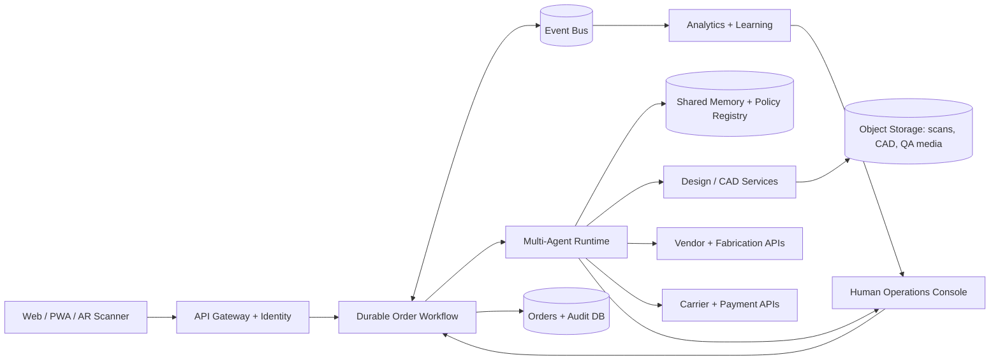
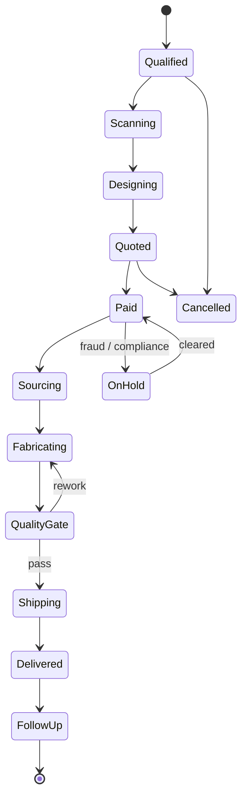

# AetherForge Collective — Technical Architecture

## Architecture objective

AetherForge coordinates a high-trust, safety-aware chain from customer room data to physical production. The architecture is event-driven, workflow-durable, multi-tenant, and designed so every material decision has a verifiable record.

## Bounded contexts

| Context | Owns | Primary services |
|---|---|---|
| Customer & Space | identity, consent, preferences, room scans | profile service, scan ingestion, privacy controls |
| Design | constraints, parametric models, BOM revisions | design agent, CAD adapter, ergonomic and structural solvers |
| Commerce | quotes, margins, payments, contracts | pricing agent, finance agent, payment adapter |
| Supply | suppliers, capacity, purchase orders | sourcing agent, vendor registry, substitution rules |
| Production | work orders, quality gates, rework | fabrication coordinator, QA agent, vision inspection |
| Fulfillment | packages, tracking, exceptions | logistics agent, carrier adapters |
| Governance | policy, audit, escalation, human approval | compliance agent, policy engine, immutable decision ledger |
| Intelligence | events, experiments, model evaluation | analytics agent, feature store, evaluation pipeline |

## Agent execution contract

Every critical agent action uses the same envelope: `tenant_id`, `order_id`, `workflow_id`, `agent_id`, `input_refs`, `policy_version`, `model_version`, `confidence`, `proposed_action`, `tool_scope`, and `idempotency_key`. An agent may propose an action only within its role; the workflow and policy engine determine whether it can execute, needs dual verification, or must pause for human approval.

Critical actions follow: perceive → reason → plan → evaluate → act → verify → learn. Reasoning summaries and evidence references are stored; private chain-of-thought is not required or retained.

## Canonical order state machine

State changes are workflow-owned, append-only events. Side effects use idempotency keys and outbox/inbox patterns. Long-running waits—customer approvals, vendor lead times, production, and shipping—are represented as durable workflow timers rather than in-memory jobs.

## Data design

- Relational system of record: tenants, users, consent, orders, order revisions, quotes, payments, vendors, work orders, packages, approvals, and audit events.
- Object storage: encrypted room scans, photos, AR assets, CAD files, manufacturing instructions, inspection media, and assembly guides.
- Vector memory: preference summaries and approved design patterns, partitioned by tenant and purpose; never the financial or legal system of record.
- Analytics warehouse: pseudonymized event stream, cohort facts, operational KPIs, experiments, and model evaluation results.
- Retention: raw room scans default to a short retention window after verified delivery; customers can revoke optional learning use and request deletion subject to transaction-record obligations.

## Security and safety

- Passwordless authentication, phishing-resistant MFA for operators, short-lived service credentials, and least-privilege tool scopes.
- Tenant isolation at the database, object-key, cache, vector-index, and event-envelope layers.
- Encryption in transit and at rest; field-level protection for high-risk personal and payment metadata.
- Tokenized payments; no raw card data in AetherForge services.
- Signed fabrication artifacts, checksum verification at every handoff, and policy-controlled release to vendors.
- Human approval for structural exceptions, safety flags, legal exposure, high-value spend, chargebacks, or policy confidence below threshold.
- Append-only audit trail for prompts, evidence references, tool calls, approvals, policy/model versions, and outcomes.

## Reliability model

Target initial service objectives: 99.9% storefront/API availability, 99.5% workflow-control availability, recovery point under 15 minutes, recovery time under 60 minutes, and zero lost order-state transitions. Multi-region comes after product-market fit; the first release uses one primary region, encrypted backups, restore drills, multi-zone data services, and provider fallbacks for payments, messaging, and shipping.

## Observability

Propagate `tenant_id`, `order_id`, and `workflow_id` through traces, structured logs, events, and tool calls. Dashboards track funnel conversion, design iteration count, cost variance, first-pass yield, SLA breaches, tool failure rate, human-escalation rate, model drift, and defect escape rate. Alerting is tied to customer impact and workflow age rather than raw infrastructure noise.

## Delivery roadmap

1. **Concierge MVP:** guided scan intake, human-reviewed AI concepts, manual vendor dispatch, payment links, and a durable order ledger.
2. **Operational platform:** parametric design pipeline, vendor portal adapters, formal QA gates, automated carrier updates, and an operator console.
3. **Adaptive system:** sensor integrations, digital twin, refresh subscriptions, resale valuation, and partner marketplace.
4. **Network scale:** automated partner qualification, regional orchestration, multi-region control plane, and enterprise tenant controls.

## Key architecture decisions

- Start as a modular monolith plus durable workflow engine; split services only at scaling or ownership boundaries.
- Keep agents stateless between calls; authoritative state belongs to databases and workflows.
- Treat generated CAD, BOM, quote, and manufacturing instructions as versioned artifacts with explicit approval lineage.
- Use policy-as-code for tool limits and escalation thresholds; prompts are not security boundaries.
- Require deterministic solvers and human sign-off for safety-critical geometry; LLM output is advisory, not structural proof.
